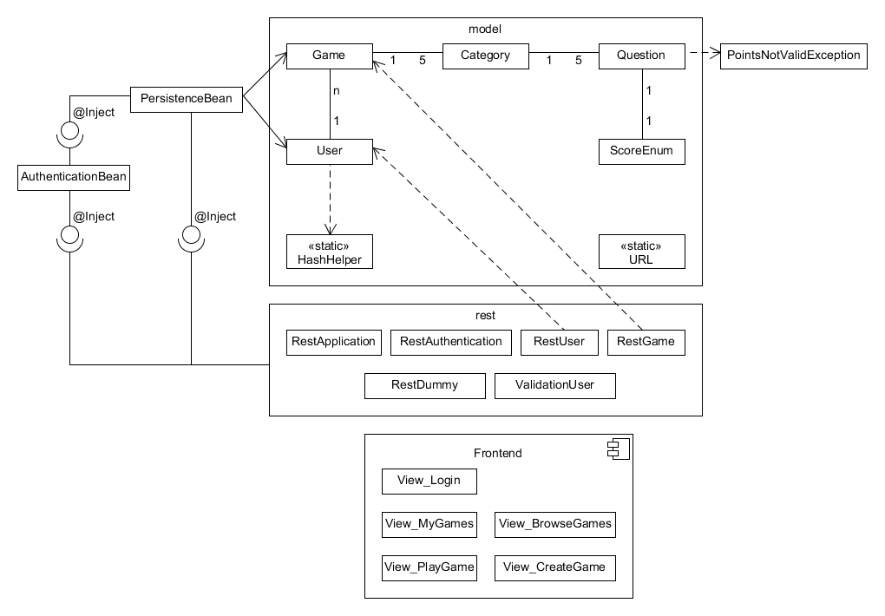

# Technische Dokumentation

## Projektidee
Das dem Projekt zugrundeliegende Idee ist einen einfachen Weg zu bieten
Jeopardy Quizze zu erstellen und diese später zu spielen. Jeopardy ist ein
aus Amerika stammendes Quiz, bei dem aus fünf Kategorien "Fragen" verschiender
Schwierigkeitsstufen gewählt werden, die dann "beantwortet" werden um Punkte
zu erhalten.
Die Quotation deshalb, da bei Jeopardy Antworten gezeigt werden, die mit einer
Frage "beantwortet" werden sollen. Schwierigere Fragen/Antworten geben
verständlicherweise mehr Punkte.
Das Ziel des Projektes ist auf möglichst einfache Weise ganze Quizze, die Kategorien
und die Fragen anzulegen, die von einem Quizmaster dann präsentiert und durchgeführt
werden können.

## Verständlichkeit
### Backend
Die Anwendung setzt sich zusammen aus Backend und Frontend. Das Backend stellt
eine RESTful  API bereit, über die sowohl User- als auch Quizdaten angelegt,
abgerufen, verändert und gelöscht werden können. Die Daten werden in der in Wildfly
integrierten H2 Datenbank (Datasource 'ExampleDS') für die Laufzeit persistiert. Es
muss also kein Datenbank Schema zum Ausführen dieser Anwendung angelegt werden. Im
Gegenzug bleiben die Daten bei einem Server Neustart allerdings nicht enthalten.
Um schnell wieder Testdaten erzeugen zu können wurde ein weiterer REST Endpunkt 
bereitgestellt, bei dessen Aufruf der Server Dummy Datensätze erzeugt und in der
Datenbank ablegt. Zudem wurde in der Datei `backend.html` eine Ansicht erstellt
um den Aufruf dieses Endpunktes zu vereinfachen und im Frontend auf der Login Seite 
ein Button eingefügt, der auf diese Ansicht verweist.

### Frontend
Das Frontend wurde in Angular entwickelt und bezieht die anzuzeigenden Daten über 
die RESTful API vom Backend. Für die verschiedenen Ansichten wurden jeweils eigene
Komponenten erstellt, die nach Bedarf um Services ergänzt wurden. Zusätzlich dazu wurde
ein Authentifizierungs-Service für das Login und Session Handling sowie ein Auth Guard
implementiert, der bei jeder Anfrage die Gültigkeit der Anmeldung überprüft. Diese 
Überprüfung findet sowohl lokal im Frontend (Session Attribut `isLoggedIn`) wie auch 
parallel dazu im Backend durch einen weiteren REST Endpunkt statt. Um das Frontend
auszuliefern wurde es zunächst in statisches Javascript kompiliert und dann in das
in der Maven Konfiguration definierte `webResources` Verzeichnis kopiert. Das führt dazu,
dass der Wildfly Server selbst das Frontend und das Backend ausliefert. Damit das
funktioniert, musste im Angular App Routing die option `useHash: true` gesetzt werden,
wodurch die Frontend Pfade nicht mehr als Server-Pfade, sondern mit einem vorangestellten
'#' kompiliert werden. Zudem musste ein Mechanismus eingebaut werden, der nach einem
Neuladen der Seite (Angular State wird dabei resettet) die Session aus dem localStorage
wiederherstellt. Da dabei auch der User Name und die User Id in den localStorage geschrieben
werden und diese potenziell durch Benutzer geändert werden können, werden diese beiden 
bei der serverseitigen Überprüfung der Authentizität ebenfalls geprüft. Dies hat bisher
keinen Nutzen für die Anwendung, aber sollten später mal Rechte mit der User Id verbunden
sein, sind die Sicherheits-Vorkehrungen dafür bereits getroffen. 

### Geschützte Bereiche und Endpoints
Im Frontend ist quasi alles ein geschützter Bereich außer natürlich die Login und die
Registrier-Ansicht. Ist man ein eingeloggt, kann man alles sehen, jedes Quiz spielen 
und selbst neue Quizzes anlegen.

### Maven
Die Maven Konfiguration umfasst im Wesentlichen nur die Beschaffung der Abhängigkeiten
und die Regeln für den Build. Die `web.xml` musste außerhalb des `webapp` Verzeichnisses
angelegt werden um das kompilieren des Frontends in dieses Verzeichnis zu ermöglichen,
da dabei der komplette Ordnerinhalt gelöscht wird.

### JavaEE
Die Beans werden durch Annotations automatisch entdeckt. Servlets mussten keine erstellt
werden, da durch die Klasse `RestApplication` automatisch eines für die RESTful API erzeugt
wird. Für die Persistenz wurde wie gesagt der `ExampleDS` Datasrote von Wildfly verwendet.

## Design

Das Diagramm zeigt die verscheidenen Unterteilungsebenen der Anwendung, auf technischer
Seite liegt dabei der Fokus auf den "model"- und "rest"-Ordnern.
Das Model enthält neben den Classes die das Spiel ausmachen auch solche, die
zur interaktion mit selbigem gebraucht werden, wie der HashHelper zur einheitlichen
generierung von Hashes der Passwörter.
Auch ersichtlich werden die Assoziationen und deren Kardinalitäten, dass z.B. jedes Spiel
aus fünf Kategorien und diese jeweils wiederum aus fünf Fragen bestehen.

Die Beans am linken Rand, stellen die Persistenzmöglichkeit für die model Klassen
dar, die dann wiederum via Injects an die Schnittstellen zum Frontend weitergereicht werden.
Für die Authentifizierung wurde eine separate Bean, die Authentication Bean geschaffen.

Genannte Schnittstellen zum Frontend sind als REST-Endpoints modelliert, diese sind
gesondert in dem Ordner rest konzentriert. Gleichzeitig sind sie im Diagramm visuell bewusst auch
zwischen den Spiel- und Logiklassen und dem Frontend positioniert.

### Beans
In der Anwendung gibt es drei Beans. Eines für die Authentifizierung, eines für die Dummy
Daten und eines für Persistenz Aufgaben. Das `AuthenticationBean` erledigt Aufgaben wie den
Login, Logout, Erzeugung von Tokens und Gültigkeitsprüfung von Tokens. Das heißt, es wird
überall dort verwendet, wo überprüft werden muss, ob die Anfrage von einem authentifizierten
Benutzer stammt. Das `DummyBean` hat lediglich den Zweck den State zu halten ob die Dummy
Daten bereits angelegt wurden oder nicht. Im `PersistenceBean` finden sämtliche Interaktionen
mit der Datenbank statt.

### Models
Da das Datenmodell dieser Anwendung sehr einfach gehalten wurde, sind die Models für die
Auslieferung der Daten auch gleichzeitig die Entities für Persistenzschicht. Die ids der
Entities sind alle 'generatedValues', so dass man sich darüber keine Gedanken machen muss.
Der einzige selbst definierte Constraint im Datenmodell ist das `unique` Constraint auf dem
User Namen. Für die Kaskadierung von Game (Quiz), Category und Question wurde der Typ ALL
gewählt, wodurch z.B. bei einer Löschung eines Games auch die zugeordneten Categories und 
Questions entfernt werden, da diese nicht alleine existieren sollen.

### Rest
Durch die Anwesenheit der Klasse `RestApplication` wird das Servlet für die RESTful API
erzeugt. Die weiteren Klassen unterteilen die REST Endpoints in mehrere Bereiche:
Authentifizierung, Dummy Daten, User und Games (Quizzes). Die Klasse `ValidationUser`
dient als Datenstruktur für die Validierung von einem Token mit zugehöriger User Id und
Username. Aus den geschützten Endpoints wird jeweils die Methode `authenticateUserByAuthToken()`
aus dem `AuthenticationBean` aufgerufen. Ist das Token gültig, werden die entsprechenden
Daten aus der Datenbank geholt und zurück gegeben. Andernfalls wird der HTTP Status 401
Unauthorized in den Antwort-Header geschrieben. Wird ein einzelnes Objekt mit einer 
ungültigen ID angefragt, so kommt in den Antwort-Header der Status 404 Not Found.
Das Token wird bei jeder Anfrage im Header unter der Bezeichnung `X-Auth-Token`
erwartet. Wird dieser Header nicht mitgeschickt, erhält der Anfragende ebenfalls
den Status 401.

### Authentifizierung
Die Authentifizierung des Nutzers der Anwendung beginnt durch die Übertragung des
Passworts durch das Frontend an das Backend. In letzterem werden die Login Daten
überprüft, zuerst durch die Methode „authenticateUserByUsernameAndPassword“. Falls
die Nutzerdaten korrekt waren, wird dem Frontend ein frisch generiertes Authentication
Token übergeben. Das Token sind hierbei 32 zufällige Bytes.

Zur sicheren Speicherung der Login Daten wird die HashHelper Klasse benötigt, die aus
dem Password einen „SHA-256“-Hash generiert.

Bei weiteren Authentifizierungen wird ab jetzt das Authentication Token zurate gezogen.
Der Nutzer kann mittels der Methode „authenticateUserByAuthToken“ ermittelt werden, da
das Token als Key in einer ConcurrentHashMap hinterlegt wurde, deren Value der
entsprechende User ist. Ebenfalls in der Hashmap sind die Zeiten hinterlegt, die benötigt
werden das Token nach fixer Zeit auslaufen zu lassen. So wird auch bei jeder Anfrage an
das Backend ab hier geprüft ob das Token abgelaufen ist, falls nicht wird es automatisch
zurückgesetzt, bzw. sinngemäß der Countdown resettet. Die Ablaufzeit ist aktuell auf 300
Sekunden gesetzt.

Zum Ausloggen wird entsprechend ein Mechanismus zur Invalidierung gebraucht, der mit
Methode „invalidateAuthToken“ gegeben ist, die dann nur die Einträge aus den beiden
HashMaps nehmen muss.

### Testdaten
Um leicht Testdaten generieren zu können, wurde ein separater Rest-Endpoint zum
Generieren dieser geschaffen. Da die Testdaten nur zum Demonstrieren der Funktionalität
und beim Testen, auch des Frontends, gebraucht wurden, mussten diese keine sinnvollen
Fragen enthalten. Jedoch sollten z.B. Fragen und Kategorien einzigartig benannt sein,
weshalb diese auf einen Counter setzen um diese zu benennen.